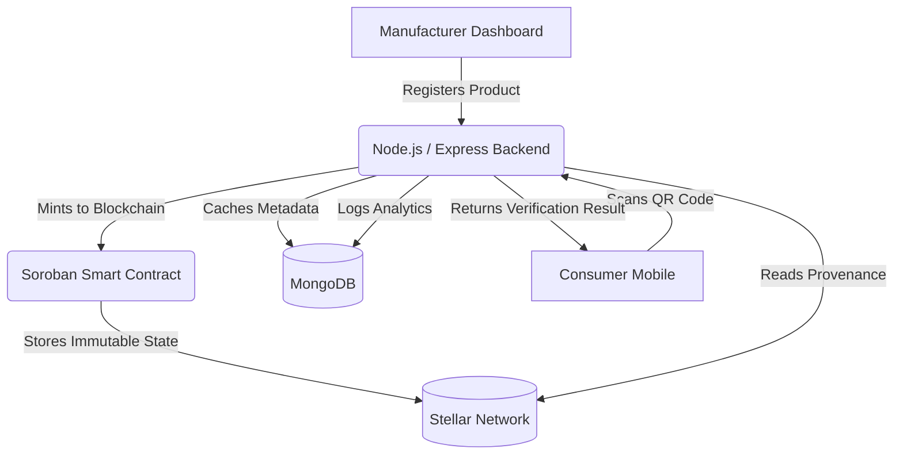
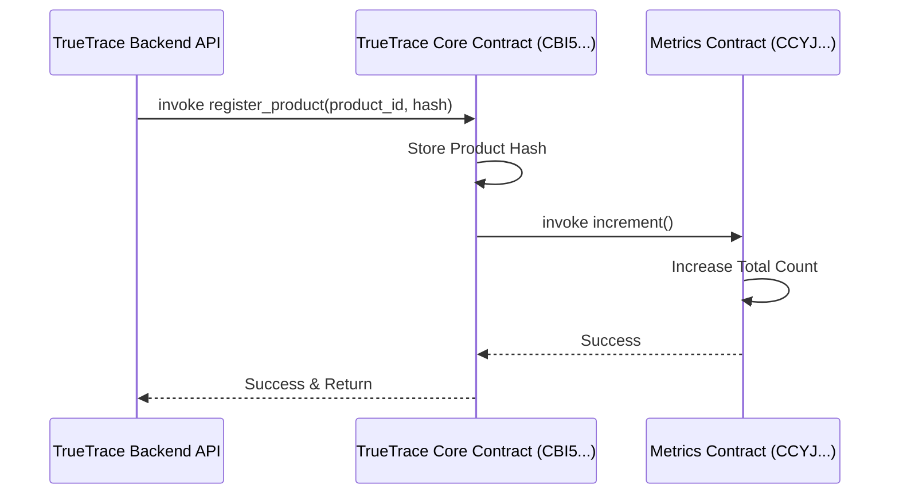

<div align="center">
  
# TrueTrace

**Verify Every Product. Trust Every Purchase. Blockchain-powered supply chain authenticity built on the Stellar network using Soroban Smart Contracts.**

[](https://stellar.org/)
[](https://soroban.stellar.org/)

 

  <h3>🚀 Live Production Deployment: https://true-trace-phi.vercel.app/</h3>
  <h3>🎥 Demo Video Walkthrough: https://drive.google.com/file/d/1_pYjiXmi5TKP7yDDcMiWtmJfUx1CDLAy/view?usp=drivesdk</h3>
  <h3>🔗 User wallet interactions:https://docs.google.com/spreadsheets/d/13kiGrDQKRWCqQvcO97PAoAkYnGbBrQ2SOHBwgZbOsYg/edit?usp=sharing</h3>


*"TrueTrace is a Web3 supply chain verification platform that allows manufacturers to register products securely on the Stellar blockchain, providing consumers with an immutable source of truth to verify the authenticity and lifecycle of their purchases."*

</div>

---

## 📖 Project Overview

### The Problem
Counterfeit products remain a pervasive issue across global supply chains. When manufacturers release products, tracking them securely and ensuring end-consumers receive genuine items is extremely difficult. Traditional databases can be tampered with, and basic QR codes can easily be cloned.

### The Solution: TrueTrace
TrueTrace solves this by anchoring product metadata and lifecycle events directly to the Stellar blockchain. 
- **Immutable Registration:** Manufacturers mint their product records as unique, immutable assets on-chain via Soroban smart contracts.
- **Consumer Verification:** Consumers simply scan a QR code to read the item's digital passport, fetching the unalterable truth from the decentralized ledger.
- **Counterfeit Detection:** Through our scan history engine, repeated scans of cloned items or scans from impossible geographic locations flag the item as a potential counterfeit, protecting both brand integrity and consumer safety.

### Why Stellar & Soroban?
- **Stellar Network:** Stellar's low transaction fees (fractions of a cent) and rapid consensus (3-5 seconds) make it the perfect ledger for high-volume supply chain operations.
- **Soroban Smart Contracts:** Soroban provides a secure, predictable Rust-based WebAssembly environment, ensuring that the custody and status rules of every product are enforced immutably on-chain.

- **Dual-Contract Architecture:** 

 - **Metrics Contract (`truetrace-metrics`)**
   - **Role:** Acts as a global, immutable counter for platform analytics.
   - **Storage:** Persists a global `COUNT` representing the total number of products secured across the entire TrueTrace ecosystem.
   - **Functions:** `increment`, `get_count`.

- **Core Supply Chain Contract (`truetrace-core`)**
   - **Role:** Handles the actual product registration and cryptographic hash verification to prove authenticity.
   - **Storage:** Persists `Product` records (mapping Product IDs to their secure hashes) and the address of the linked Metrics Contract.
   - **Inter-Contract Communication:** When a manufacturer calls `register_product()`, the Core contract successfully records the product hash, and then dynamically invokes the Metrics Contract to instantly increment the global platform counter.


---

## 🚀 Features & Tech Stack

**Frontend Layer**
- **Framework:** React with Vite
- **Styling:** Tailwind CSS
- **Integration:** Stellar SDK / Soroban RPC

**Backend Layer**
- **Server:** Node.js & Express.js
- **Database:** MongoDB (via Mongoose) for off-chain analytics and fast queries (e.g., Scan History mapping).
- **Authentication:** JWT Role-Based Access (Admin/Manufacturer).

**Blockchain Layer**
- **Smart Contracts:** Rust (Soroban SDK)
- **Network:** Stellar Testnet

---

## ⚙️ Architecture & Core Mechanism

### High-Level System Architecture


### Inter-Contract Communication Flow


1. **Backend Integration (Express & MongoDB):** The backend serves as the bridge for creating product templates and logging off-chain telemetry like IP addresses, locations, and timestamps (`ScanHistory` model). This allows manufacturers to see deep analytics without bogging down the blockchain with unnecessary data.
2. **Soroban Smart Contracts (Rust):** The heavy lifting of trust is executed on-chain. When a product is registered, the Soroban `truetrace` contract permanently records its existence and status on the Stellar network. 
3. **Frontend Dashboard:** A rich React frontend provides manufacturers with insights, generated QR codes, and total verification counts. Consumers use a lightweight, mobile-responsive view to scan and verify.

---

## 📁 Project Directory Structure

```text
TrueTrace/
├── backend/                  # Express.js Node API & MongoDB Models
│   ├── models/               # Mongoose schemas (ScanHistory, Product, etc)
│   ├── routes/               # API Endpoints (Admin, Verification, Public)
│   └── server.js             # Main Backend Entrypoint
├── blockchain/               # Soroban Smart Contracts Workspace
│   ├── contracts/truetrace/  # Core Product Registry Contract in Rust
│   ├── contracts/metrics/    # Analytics & Counter Contract in Rust (Inter-Contract)
│   └── Cargo.toml            # Rust Workspace configuration
├── frontend/                 # React Frontend Application (Vite)
│   ├── src/pages/            # Manufacturer Dashboards & Public Views
│   └── package.json          # NPM Dependencies
└── README.md                 # Project Documentation

```

---

## 📸 Platform Previews

### 🌟 Manufacturer Dashboard
*Manufacturers can track all minted products, total authentic scans, and potential counterfeits in one clean dashboard.*


### 🔍 Consumer QR Verification
*Consumers scan the physical QR code to immediately see the product's on-chain provenance and verification status.*


### 📊 Scan History Analytics
*Detailed reports on where and when products are being scanned.*


### 📊 Switch Dark & light theme 


---

# Screenshots


### CI/CD Pipeline Running


### Mobile UI Screenshot 


### Test case 


---
## 🌐 Deployed Smart Contract:

The Soroban smart contract is deployed on the Stellar Testnet:

- **TrueTrace Contract (Core) ID**: `CBI5GWR2SV2LYLM2COSMLY7NGCLIJGFAS3J65XMQW67MBPKD3MRTW4MN`
- **Stellar.expert Explorer Link**:https://stellar.expert/explorer/testnet/contract/CBI5GWR2SV2LYLM2COSMLY7NGCLIJGFAS3J65XMQW67MBPKD3MRTW4MN
- **Metrics Contract ID**: `CCYJY3SFYNBXQ7BXPUAFCAMLJSWEX3XFASOSIMM5UGSOWYCTC7WXKPRG`
- **Stellar.expert Explorer Link**:https://stellar.expert/explorer/testnet/contract/CCYJY3SFYNBXQ7BXPUAFCAMLJSWEX3XFASOSIMM5UGSOWYCTC7WXKPRG
  
**Recent Transactions:**
- **Metrics Contract Deployment ID**: db5cd95b5ab03ac969c001bc660c5f5d1b26258ece58b47f88879741e4a3eb46
- **Metrics Contract Deployment Link**:https://stellar.expert/explorer/testnet/tx/16081774895456256
- **Core Cross-Contract Initialization**: 816be8b5e64172080397571b75ae4858bc21f346583369be8bda6e50054c12ad
- **Core Cross-Contract Initialization Link**:https://stellar.expert/explorer/testnet/tx/16081783485415424
---
## 🛡️ CI/CD Pipeline & Deployment

TrueTrace is built with production in mind. 
- **Vercel:** We recommend deploying the React frontend to Vercel. Connect the GitHub repo, set the Framework Preset to Vite, and configure your `.env` variables.
- **Render:** Deploy the Node.js backend to Render as a Web Service. Ensure your `MONGO_URI` and other secrets are safely stored in the environment configuration.
- **GitHub Actions:** The repository includes a robust CI/CD pipeline (`.github/workflows/ci-cd.yml`) that automatically lints, tests, and builds the Rust smart contract (`wasm32-unknown-unknown`) on every push.

---

## 💻 Local Development & Setup

### Prerequisites
- Node.js (v20+)
- Rust (v1.80+) and `stellar-cli`
- MongoDB instance (local or Atlas)

### Backend Setup
```bash
cd backend
npm install
# Create a .env file based on environment requirements (MONGO_URI, JWT_SECRET, etc.)
npm run dev
```

### Frontend Setup
```bash
cd frontend
npm install
# Create a .env file with VITE_API_URL=http://localhost:3000
npm run dev
```

### Smart Contract Deployment (Stellar Testnet)
Smart Contract Deployment (Stellar Testnet)

```bash
# Navigate to the scripts directory
cd scripts

# Run the automated deployment script
# This will build, deploy, and link both the Metrics and TrueTrace contracts
node deploy_contract.js
```

---


